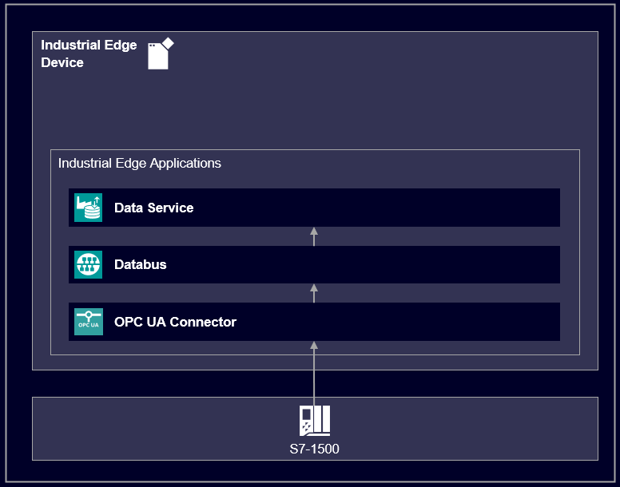

# Data Service application example

This example shows how to use the Industrial Edge App "Data Service" to model data structure and store data.

- [Data Service](#data-service)
  - [Description](#description)
    - [Overview](#overview)
    - [General task](#general-task)
  - [Requirements](#requirements)
    - [Prerequisities](#prerequisities)
    - [Used components](#used-components)
    - [TIA project](#tia-project)
  - [Configuration steps](#configuration-steps)
  - [Usage](#usage)
  - [Documentation](#documentation)
  - [Contribution](#contribution)
  - [Licence and Legal Information](#licence-and-legal-information)

## Description

### Overview

This document describes how to get the data from a PLC into the app Data Service, prepare the data and store timeseries for further usage.
A properly configured Data Service is the basis for using other Industrial Edge Apps (e.g. Performance Insight or Notifier).

### General task

The example reads data from a PLC via the S7 Connector (OPC UA).
The data is published on the IE Databus, where the Data Service can collect the needed shopfloor data.
First an adapter for providing the datapoints must be assigned and configured.
Afterwards the data structure can be modeled using assets and aspects.
Assets are used to structure the plant in logical units.
Within an asset you can create variables and link them to the appropriate datapoints, which are made available by the configured adapter.
This data is collected, saved for individual time period and transfered for further processing.
By creating an aspect, variables can be grouped to a logical unit.

## Requirements

###  Prerequisities

- Access to an Industrial Edge Management System (IEM)
- Onboarded Industial Edge Device on IEM
- Installed System Configurators for Databus and S7 Connector
- Installed System Apps Databus and S7 Connector
- Installed Data Service
- Edge device is connected to PLC
- TIA portal project loaded on PLC (e.g. for filling application)
- HTML5-capable Internet browser

### Used components

- Industrial Edge Management V1.1.14 (1.1.0-48)
  - IE Databus V1.1.15
  - IE Databus Configurator V1.1.24
  - S7 Connector V1.1.18
  - S7 Connector Configurator V1.1.18
  - Data Service V1.1.3
- Industrial Edge Device V 1.1.0-54
- TIA Portal V16
- S7-PLCSIM Advanced V3.0

### TIA Project

The used TIA Portal project can be found in the [miscellenous repository](https://github.com/industrial-edge/miscellenous) under the following name and is also used for several further application examples:

- [tia-tank-application-20201028.7z](https://github.com/industrial-edge/miscellenous/blob/main/tia-tank-application-20201028.7z)

## Configuration steps

You can find the further information about the following steps in the [docs](docs/Installation.md)
- Configure PLC Connection (Databus, S7 Connector)
- Configure Configure Data Service

## Usage

Once the Data Service app is configured and data is availalbe from a running PLC, process data can be collected.
Now the data can be used to feed other apps like Performance Insight or Notifier.

## Documentation

You can find further documentation and help in the following links
  - [Industrial Edge Hub](https://iehub.eu1.edge.siemens.cloud/#/documentation)
  - [Industrial Edge Forum](https://www.siemens.com/industrial-edge-forum)
  - [Industrial Edge landing page](https://new.siemens.com/global/en/products/automation/topic-areas/industrial-edge/simatic-edge.html)
  
## Contribution

Thanks for your interest in contributing. Anybody is free to report bugs, unclear documenation, and other problems regarding this repository in the Issues section or, even better, is free to propose any changes to this repository using Merge Requests.

## Licence and Legal Information

Please read the [Legal information](LICENSE.md).
