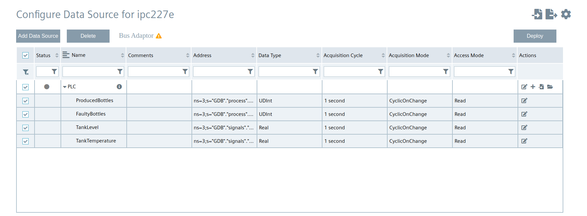
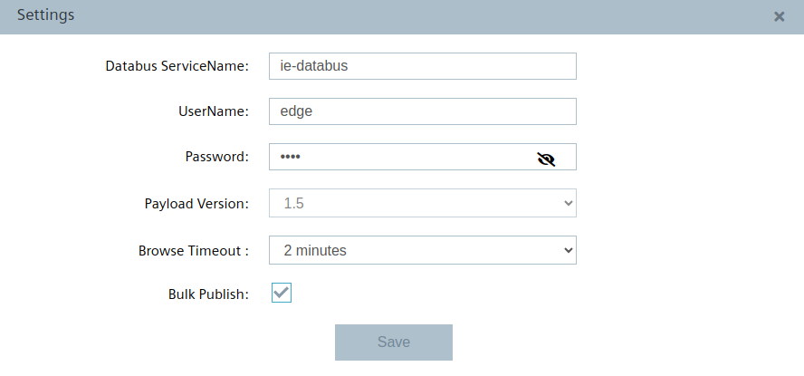
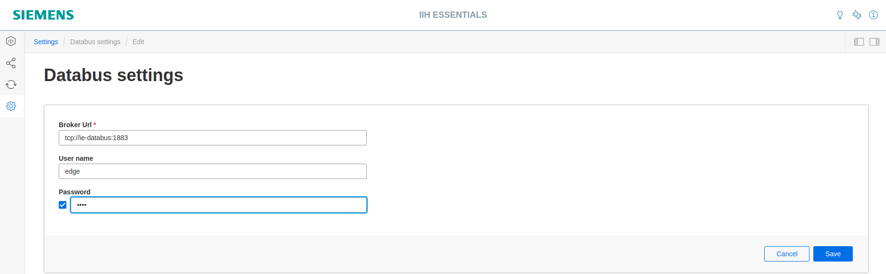
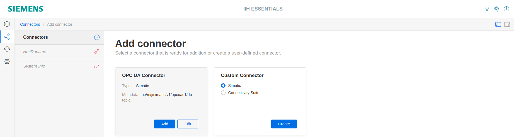
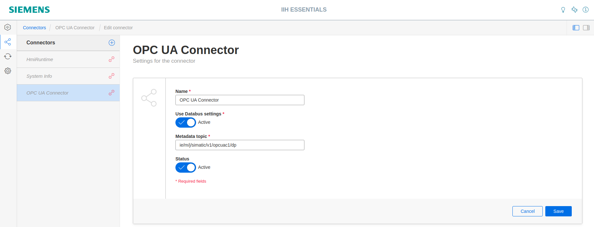
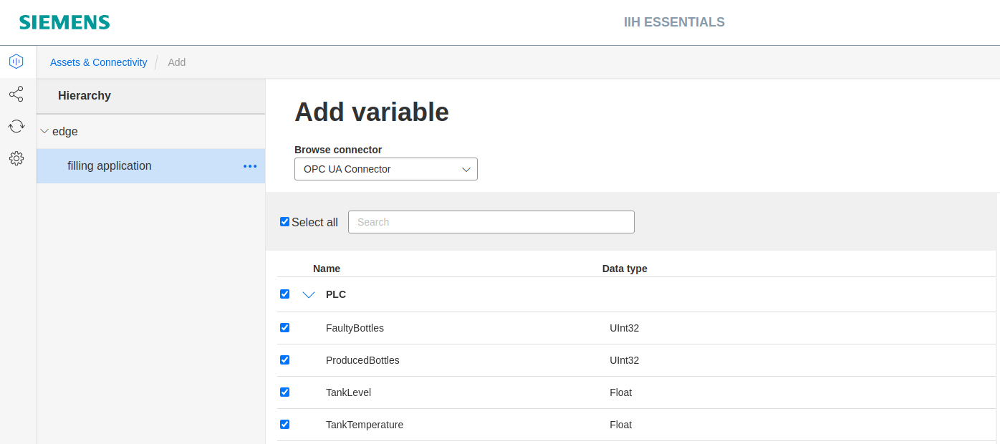

# Configuration

- [Configuration](#configuration)
  - [Configure PLC Connection](#configure-plc-connection)
    - [Configure Databus](#configure-databus)
    - [Configure OPC UA Connector](#configure-opc-ua-connector)
  - [Configure IIH Essentials](#configure-iih-essentials)
    - [Configure the adapter](#configure-the-adapter)
    - [Configure an Asset with variables](#configure-an-asset-with-variables)
    - [Configure an aspect](#configure-an-aspect)

## Configure PLC Connection

To read and provide data from the PLC, we will use OPC UA Connector to establish connection with the PLC via OPC UA.
The OPC UA Connector sends the data to the Databus, where the IIH Essentials app can collect what is needed.
In order to build this infrastructure, these apps must be configured properly:

- Databus
- OPC UA Connector

### Configure Databus

In your IEM go to Data Connections and launch the Databus configurator.

Create a user and grant permission to access topic. For example:

- Username: `edge`
- Password: `edge`
- Topic name: `ie/#`
- Permission: `Publish and Subscribe`

<kbd></kbd>

<kbd></kbd>

Deploy the configuration.

### Configure OPC UA Connector

In your IEM go to Data Connections and launch the OPC UA Connector configurator.

Add a data source:

<kbd></kbd>

Add needed tags:

<kbd></kbd>

- ProducedBottles: ns=3;s="GDB"."process"."numberProduced"
- FaultyBottles: ns=3;s="GDB"."process"."numberFaulty"
- TankLevel: ns=3;s="GDB"."signals"."tankSignals"."actLevel"	
- TankTemperature: ns=3;s="GDB"."signals"."tankSignals"."actTemperature"	

Edit settings:

<kbd></kbd>

Hint: Enter username and password of user created in Databus Configurator.

Deploy project.

## Configure IIH Essentials

In your IED Web UI open the app IIH Essentials.

### Configure the adapter

Click on the icon "Settings" on the left sidebar. Then open "Databus Settings" and Enter username and password of user created in Databus Configurator.

<kbd></kbd>

Click on the icon "Connectors" on the left sidebar. To add a connector click on the plus icon. IIH Essentials discovers automatically all available connectors. In this case OPC UA Connector is shown. 

<kbd></kbd>

To use the connector click on "Add". The connector must now be activated. Therfore select this connector and click on edit, set status to activated and save

<kbd></kbd>

The connector (here OPC UA Connector) is now activated and connected to the IIH Essentials.

<kbd></kbd>

### Configure an Asset with variables

An Asset is a digital representation of a machine or automation system with one or more automation units (e.g. PLC). The data that describes an Asset is collected and transferred. The data is then made available for further processing and evaluation.

On the left sidebar click the icon "Assets & Connectivity". For the "edge" Asset you can add child Assets as needed. Click "Create first variable" or "Add variable" on the right side to add one or more tags. Choose OPC UA Connector that is activated and select a tag provided by that adapter.

<kbd></kbd>

After adding all variables it looks as following

<kbd></kbd>

Using the **variables preview**, you can immediately check whether data is transmitted from the Databus:

<kbd></kbd>

The **data storage period** can be set individually for each Asset. The data is deleted from the disk after this time.
To change the this time period, click on the edit next to the name of the Asset:

<kbd></kbd>

### Configure an aspect

An aspect is a mechanism for data modeling of Assets. Aspects group related data points (topics) based on their logical assignment.

Choose the register "Aspects" to create a new aspect by clicking "Create first aspect" or "Add aspect".

<kbd></kbd>

Hint: An aspect can include several variables, but each variable can only be assigned to one aspect.

<kbd></kbd>

