# Configuration

- [Configuration](#configuration)
  - [Configure PLC Connection](#configure-plc-connection)
    - [Configure Databus](#configure-databus)
    - [Configure OPC UA Connector](#configure-opc-ua-connector)
  - [Configure IIH Essentials](#configure-iih-essentials)
    - [Configure Connector](#configure-connector)
    - [Configure an Asset with variables](#configure-an-asset-with-variables)
    - [Configure an Aspect](#configure-an-aspect)

## Configure PLC Connection

We will use the OPC UA Connector to retrieve data from a PLC with OPC UA Server and provide the data to Edge Applications. The OPC UA Connector establishes a connection to the PLC via the OPC UA protocol and publishes data to Databus, where IIH Essentials gathers the required data. 
In order to setup IIH Essentials, first these apps must be configured properly:

- Databus
- OPC UA Connector

### Configure Databus

1. In your `IEM` go to `Data Connections` and launch the `Databus configurator`.
2. Create a user and grant permission to access topic. For example:
   - Username: `edge`
   - Password: `edge`
   - Topic name: `ie/#`
   - Permission: `Publish and Subscribe`

<kbd>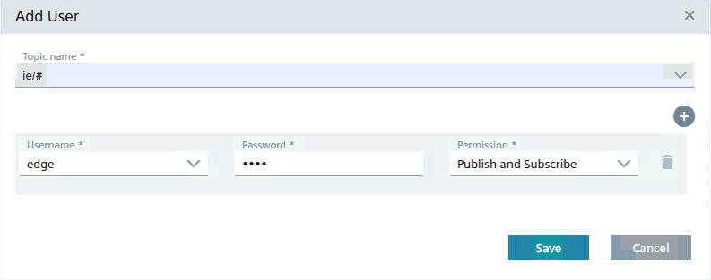</kbd>

<kbd></kbd>

1. Deploy the configuration.

### Configure OPC UA Connector

1. In your `IED` go to `Common Configurator > Get data` and select `OPC UA Connector`.

<kbd></kbd>

2. Add a data source:

<kbd></kbd>

1. Add tags:
Click on `Browse Tags` and select the desired Tags for you setup.
Configure the Aquisition Properties and click `Save for Import`and afterwards `Add to Data Source`

<kbd>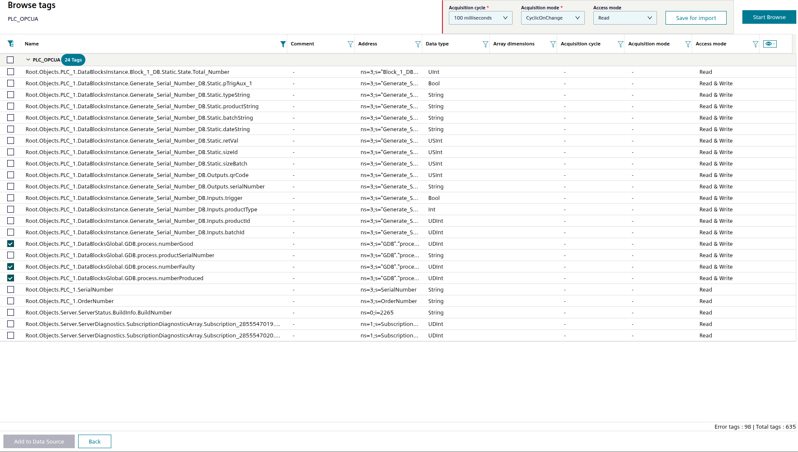</kbd>

   - ProducedBottles: ns=3;s="GDB"."process"."numberProduced"
   - FaultyBottles: ns=3;s="GDB"."process"."numberFaulty"
   - GoodBottles: ns=3;s="GDB"."process"."numberGood"

1. Deploy project.

## Configure IIH Essentials

In your IED Web UI open the app IIH Essentials.

### Configure Connector

1. Click on the icon `Settings` on the left sidebar. Then open `Databus Settings` and enter username and password of user created in Databus Configurator.

<kbd>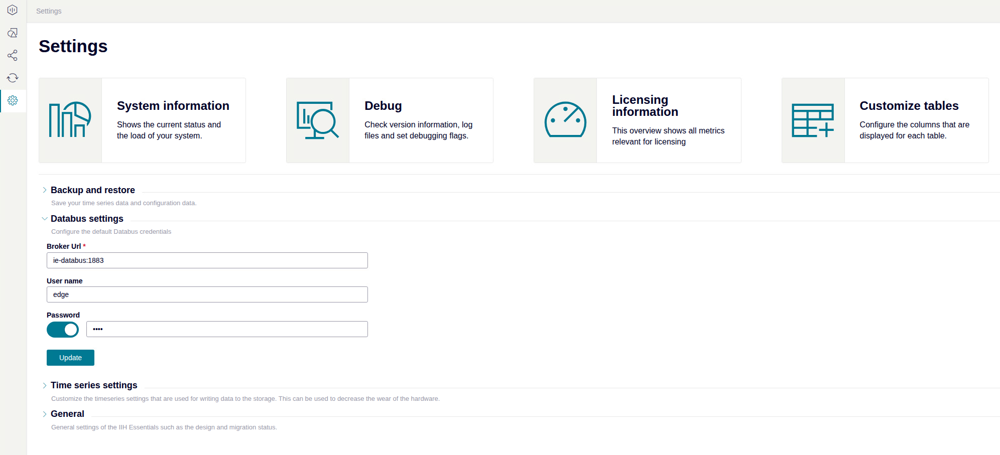</kbd>

1. Click on the icon `Connectors` on the left sidebar. To add a connector click on the `plus` icon. IIH Essentials discovers automatically all available connectors. In this case OPC UA Connector is already shown. 

<kbd>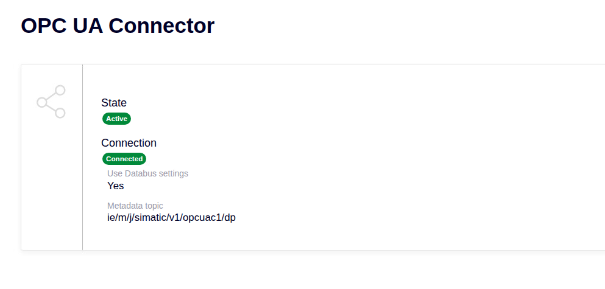</kbd>

### Configure an Asset with variables

An Asset is a digital representation of a machine or automation system with one or more automation units (e.g. PLC). The data that describes an Asset is collected and stored. The data is then made available for further processing and evaluation.

1. On the left sidebar click the icon `Manage Data`. For the "edge" Asset you can add child Assets as needed. Click on the `Plus Icon` next to edge or the `Plus Icon` on the right side to add one or more tags.

<kbd>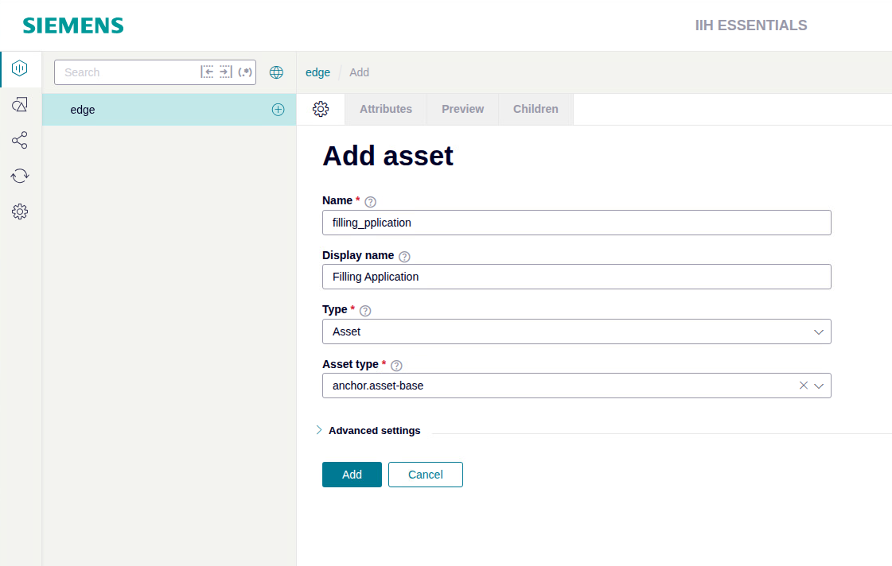</kbd>

2. Choose OPC UA Connector and select one or multiple tags.

<kbd>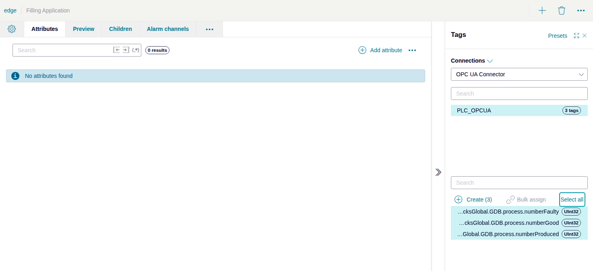</kbd>

After adding all variables it looks as following

<kbd>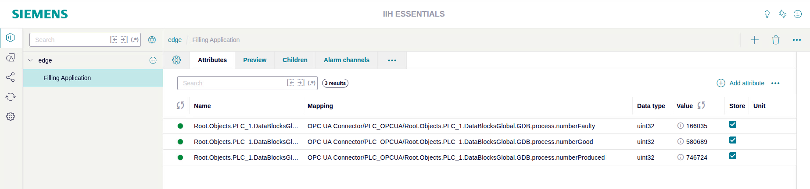</kbd>

Using the **variables preview**, you can immediately check whether data is received from Databus:

<kbd>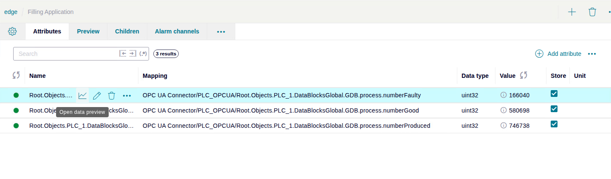</kbd>

<kbd>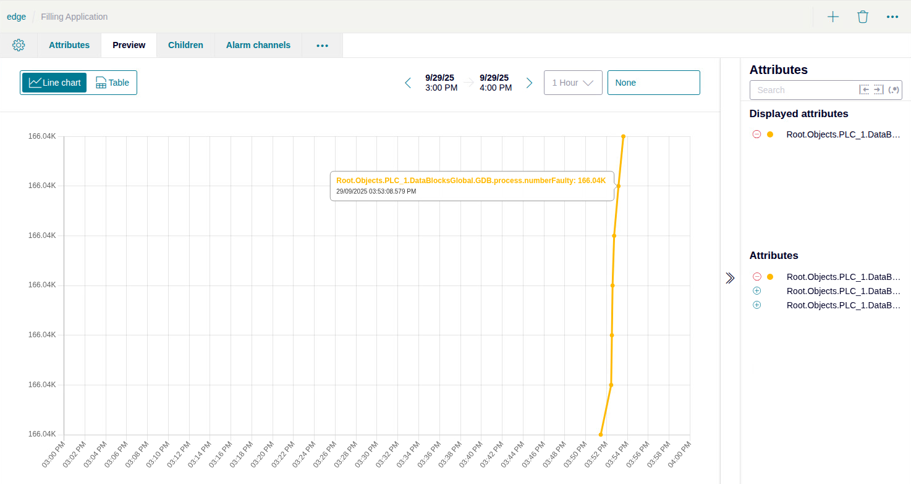</kbd>

The **data storage period** can be set individually for each Asset. The data is deleted from the disk after this time.
To change the this time period, click on edit next to the name of the Asset:

<kbd>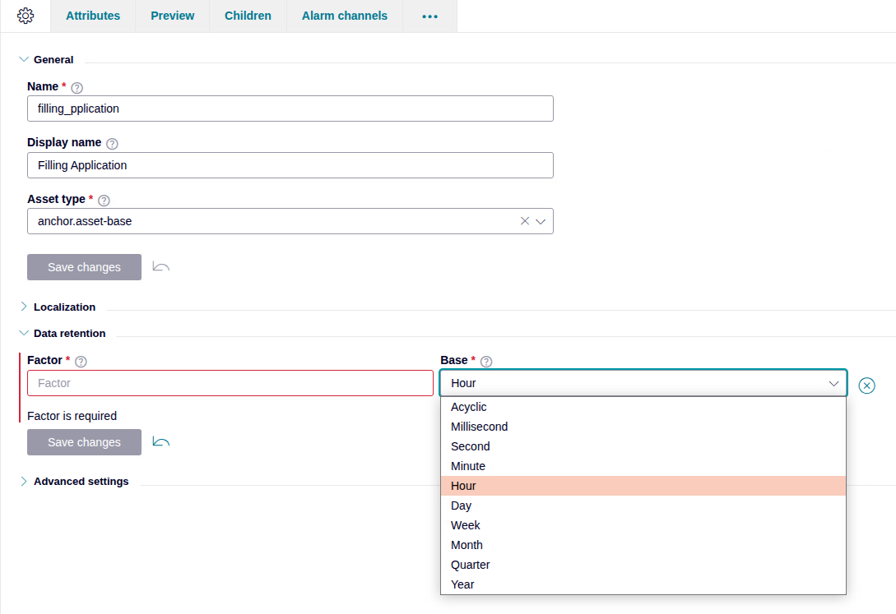</kbd>

### Configure an Aspect

An Aspect is a mechanism for data modeling of Assets. Aspects group related variables (tags) based on their logical assignment.

Choose the register `Aspects` on the created Asset to create a new Aspect by clicking `Create first Aspect` or `Add Aspect`.

<kbd>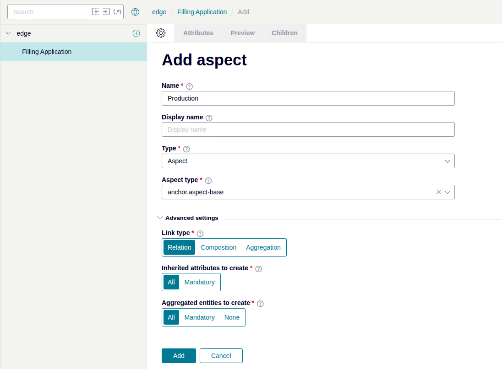</kbd>

Hint: An Assets can have multiple Aspects/Assets for Children, but Aspects can only have Aspects for Children.

<kbd>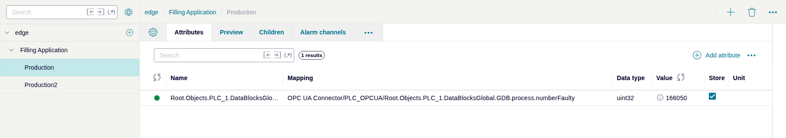</kbd>

